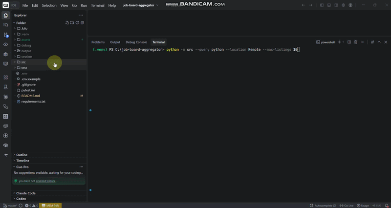
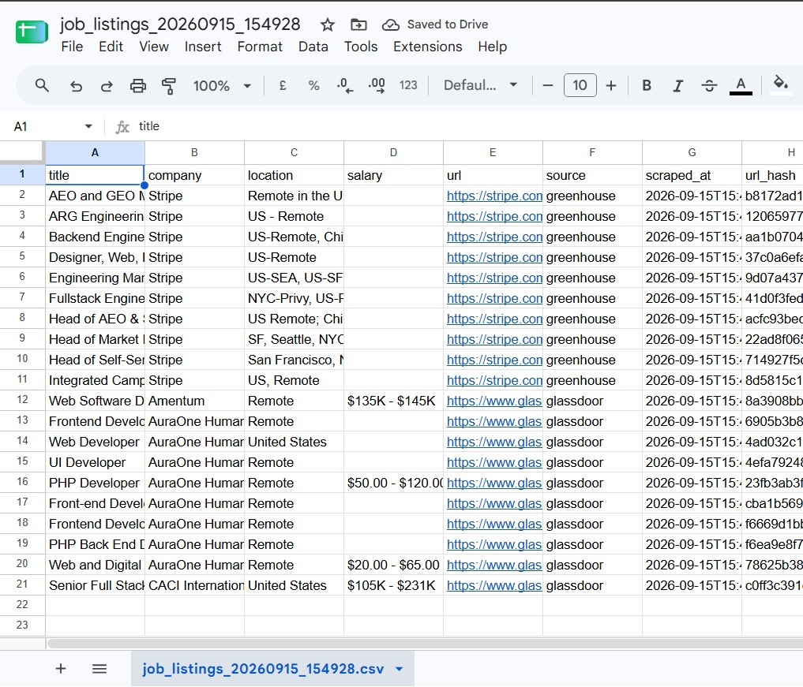
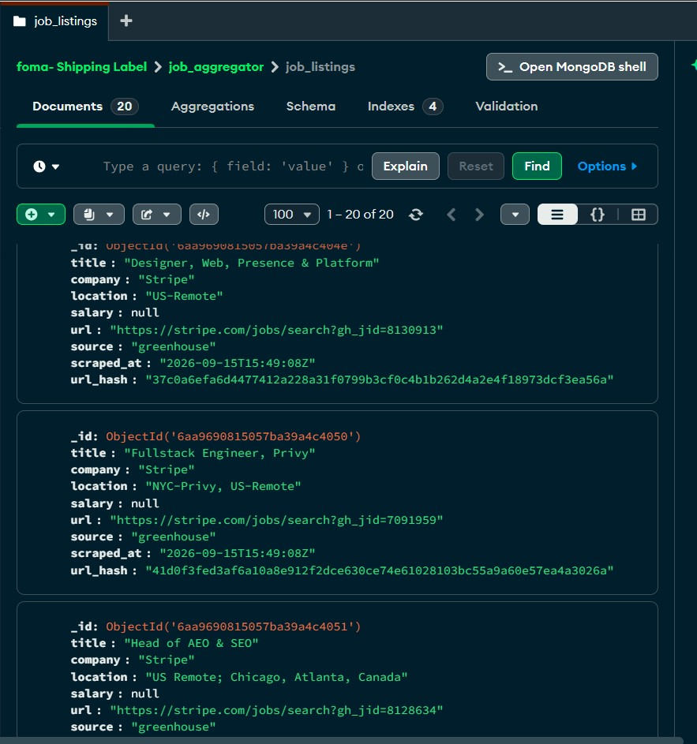
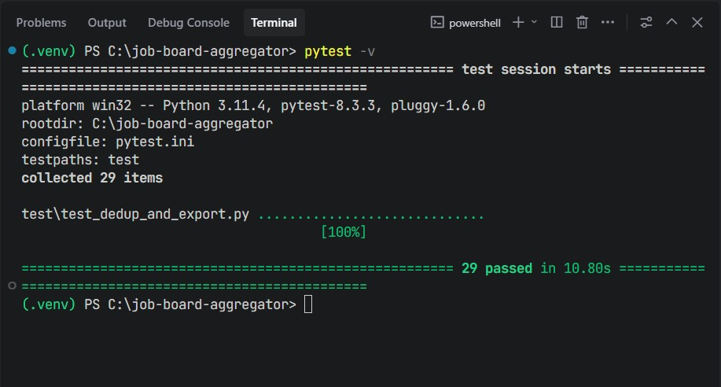

# Multi-Source Job Board Aggregator

Pulls software job listings from Greenhouse (JSON API) and Glassdoor (Patchright + real Chrome) into a normalized dataset backed by MongoDB. Exports a paired CSV and JSON on every run.

## Sources

| Source | Method |
|--------|--------|
| Greenhouse | `httpx.AsyncClient` against public boards; post-fetch filters by query/location token overlap. |
| Glassdoor  | Patchright Chromium context using your local Google Chrome install, the live Glassdoor search page, and append-only "Show more" pagination. |

## Install

Requires Python 3.11+, a local MongoDB 4.4+ (or Atlas URI), and Google Chrome on PATH (Patchright uses real Chrome, not bundled Chromium).

```powershell
git clone https://github.com/fomativeh/job-board-aggregator.git
cd job-board-aggregator
python -m venv .venv
.venv\Scripts\Activate.ps1
python -m pip install --upgrade pip
pip install -r requirements.txt
Copy-Item .env.example .env
notepad .env
```

`.env` has three required fields:

| Name | Purpose |
|------|---------|
| `MONGO_URI` | Local default `mongodb://localhost:27017` or an Atlas `mongodb+srv://…` URI |
| `MONGO_DB` | Database name (ships with `job_aggregator`) |
| `MONGO_COLLECTION` | Collection name (ships with `job_listings`) |

Optional: `LOG_LEVEL` (one of DEBUG / INFO / WARNING / ERROR / CRITICAL, default INFO) and `LOG_FILE` (additive file log path in addition to stderr).

Smoke test MongoDB:

```powershell
python -c "from src.config import load_config; from pymongo import MongoClient; c=MongoClient(load_config().mongo_uri, serverSelectionTimeoutMS=5000); c.admin.command('ping'); print('MongoDB ping OK')"
```

## Run

```powershell
python -B -m src --query python --location Remote --max-listings 10
```

| Flag | Default | Effect |
|------|---------|--------|
| `--query` | empty | Keyword filter applied across title, company, location. Empty accepts the default/latest listings each source returns. |
| `--location` | empty | Location match, including Remote synonyms (Remote, WFH, US, United States, Worldwide, and so on). Empty skips the filter. |
| `--max-listings` | 20 | Hard cap on deduped listings before DB and export writes. Also seeds each scraper's initial cap. |
| `--output-dir` | `output` | Directory for the CSV + JSON pair; created if missing. |
| `--log-level` | unset | Overrides `LOG_LEVEL` from `.env`. |
| `--log-file` | unset | Overrides `LOG_FILE` from `.env`. |

### Quota split between the two scrapers

Given a target `--max-listings N`, each scraper gets `N // 2`, then any remainder of 1 is handed to one scraper picked at random per run. Examples:

- `--max-listings 10` → both scrapers cap at 5
- `--max-listings 11` → random scraper gets 6, the other 5
- `--max-listings 31` → random scraper gets 16, the other 15

If after the initial parallel pass fewer unique listings survived dedup than the target, the pipeline can hold back and re-run only the single top-ranked non-exhausted scraper with larger caps. Scrapers that returned zero new uniques on their last run are skipped in holdback entirely.

### Sample output

```
query='python'  location='Remote'  max_listings=10

greenhouse done  rows=5 cap=5 stop=max_listings_satisfied elapsed=7.66s boards=8
glassdoor   seen=30  keep=5  clicks=0 stop=max_listings_satisfied

storage mongo connected  db=job_aggregator collection=job_listings
storage [dedup ok] 5 already stored; 5 new inserted
export csv  …\output\job_listings_20260915_155405.csv  (10 rows)
export json …\output\job_listings_20260915_155405.json (10 rows)

Listings returned  10
  greenhouse  5
  glassdoor   5
```

## Schema

Each listing is normalized into seven fields before dedup and storage. Only `salary` is nullable.

| Field | Type | Notes |
|-------|------|-------|
| `title` | string | e.g. `"Senior Backend Engineer, Payments"` |
| `company` | string | e.g. `"Stripe"` |
| `location` | string | e.g. `"Remote - EMEA"`, `"New York, NY"`, `"United States"` |
| `salary` | string \| null | e.g. `"$160,000 - $210,000 USD"`; `null` when undisclosed |
| `url` | string | absolute HTTP(S) URL to the job detail page |
| `source` | string | `"greenhouse"` or `"glassdoor"` |
| `scraped_at` | string | ISO-8601 UTC timestamp |

A SHA-256 hex digest of `url` (called `url_hash`) is the dedup key. The same unique-index guarantee is enforced in MongoDB via a unique index on `url_hash`, so each URL persists once across runs regardless of how many times it re-appears on a board.

CSV header:

```
title,company,location,salary,url,source,scraped_at,url_hash
```



Each JSON row also includes a recomputed `url_hash_verified` boolean that re-hashes the URL during export and compares it to the stored digest.

### Storage



## How each source is fetched

### Greenhouse

Plain `httpx` with rotating desktop user-agents, Chrome-shaped Accept/Sec-Fetch-* headers, a Google-first Referer fallback for cross-origin fetches, 0.8–2.4 s jitter between requests, retry on transient network errors / 429 / 5xx, and skip + log on hard 4xx client errors.

### Glassdoor

The scraper launches a persistent Patchright context that points at your locally installed Google Chrome binary (`channel = "chrome"`, headless off). Args strip the `--enable-automation` flag and disable `AutomationControlled` on the Blink side. The same user-data dir is warmed up across runs; stale cache dirs (GPUCache, Code Cache, Service Worker, Disk Cache) are cleared on module import.

Every request is routed through a handler that overwrites User-Agent with a Chrome 128 string, the full Sec-CH-UA family (arch, bitness, full-version-list, platform, platform-version, WoW64, model), and per-resource `Sec-Fetch-Dest/Mode/Site/User` that matches whether the resource is a document, script, image, or font. Referer falls back to `https://www.google.com/` when no prior Referer exists.

Auth / signup overlays are closed at three levels: a MutationObserver in the init script that hides nodes the instant they mount, a 250 ms polling fallback in the same init script, and finally an explicit pre-extraction pass that clicks the close button, invokes `.close()` on dialog nodes, hard-hides containers with `display:none`, and unlocks `<body>` overflow.

Card fields are extracted directly from each `<li>` on the jobs list via a single `page.evaluate` pass; nothing is clicked on the right pane and no new tabs are opened. Selectors used:

- title: `a[data-test="job-title"]`
- company: `span[class*="EmployerProfile_compactEmployerName__"]`
- location: `[data-test="emp-location"]`
- salary: `[data-test="detailSalary"]`
- url: anchor `href` resolved to absolute via `new URL(url, location.href).href`

"Show more" clicks are the cursor: after each click the page polls for up to 25 s for `<li>` growth, and each subsequent extract runs only over the newly appended slice `[initial_count:]` so cards are never reprocessed. Three consecutive clicks with zero new `<li>` ends pagination.

## Output

Each invocation writes a paired CSV + JSON into `output/` (or whatever `--output-dir` you pass). Files share the same UTC timestamp stem.

```
<repo>/
├── output/
│   ├── job_listings_20260915_155405.csv
│   └── job_listings_20260915_155405.json
├── session/
│   └── patchright_chrome_profile_glassdoor/
├── src/
│   ├── __main__.py
│   ├── cli.py
│   ├── config.py
│   ├── export.py
│   ├── http_utils.py
│   ├── pipeline.py
│   ├── schema.py
│   ├── storage.py
│   └── scrapers/
│       ├── greenhouse.py
│       └── glassdoor.py
├── test/
│   └── test_dedup_and_export.py
├── pytest.ini
├── requirements.txt
├── .env.example
└── .gitignore
```

## Tests

```powershell
$env:PYTEST_DISABLE_PLUGIN_AUTOLOAD=1
python -m pytest test/
python -m pytest test/ --cov=src --cov-report=term-missing
python -m mypy --strict src/ test/
```

## Exit codes

`0` success; `1` unhandled exception (see stderr traceback); `2` configuration error (check `.env`); `3` source retries exhausted; `4` Glassdoor scraper fatal; `130` user interrupt.

MIT. Respect robots.txt and rate limits when running the scrapers.
